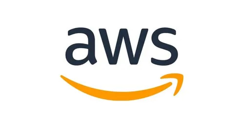

<div align="center">

</div>

<h3>Amazon Web Services (AWS) is a leading cloud service provider that offers a wide range of cloud computing services, including computing power, storage, databases, machine learning, and more. It enables businesses to build and deploy applications and services quickly and securely, without the need to invest in costly infrastructure. AWS is known for its scalability, reliability, and extensive global network of data centers.</h3>

- AWS/Azure is the cloud service providers.
- Whenever developer wants VM/EC2 from AWS/Azure or other cloud platforms, Developers go to AWS portal/Azure portal and request for VM. After requesting it will provide related specification details related to EC2/VM.
- If you require 100 Vm from cloud provider we can go cloud service provider platform 100 times, it is inefficient. 
- To make efficiency AWS provide EC2 API, to create storage AWS provide S3 AP.
- AWS peoples are built AWS EC2 API, now end-user directly going to AWS console/portal to request VM he can write script that he needs 10 EC2, by calling AWS EC2 API it will return the EC2 / VM.


### As Devops Engineer we can automate to create VM by:

- AWS CLI
- AWS API
- AWS CFT
- AWS CDK
- Terraform

<h4>AWS Management Console:</h4> 
  
  - Go to the EC2 dashboard in the AWS Management Console.
  - Click on "Launch Instance."
  - Follow the wizard to select an Amazon Machine Image (AMI), instance type, configure networking, storage, security groups, and other settings.
  - Review and launch the instance.

<h4>AWS Command Line Interface (CLI):</h4> You can use the AWS CLI to launch EC2 instances programmatically or via the command line interface. This allows for automation and scripting of instance creation.

```aws ec2 run-instances --image-id <AMI ID> --instance-type <Instance Type> --key-name <Key Pair Name> --subnet-id <Subnet ID>```

#### The AWS API allows you to programmatically interact with AWS services. You can use any programming language that supports HTTP requests to make API calls to AWS and automate the creation of VMs.

**Example** (Python using Boto3):
``` py
import boto3

ec2 = boto3.client('ec2')

response = ec2.run_instances(
    ImageId='<AMI ID>',
    InstanceType='<Instance Type>',
    KeyName='<Key Pair Name>',
    SubnetId='<Subnet ID>'
)

```
#### AWS Cloud Formation Template:
AWS CloudFormation is a service that allows you to define your infrastructure as code using templates. You can use CloudFormation templates to describe the resources you want to provision, including VMs, and AWS will handle the provisioning and management of those resources.


**Example** CloudFormation Template (YAML):
``` yaml
Resources:
  MyInstance:
    Type: AWS::EC2::Instance
    Properties:
      ImageId: <AMI ID>
      InstanceType: <Instance Type>
      KeyName: <Key Pair Name>
      SubnetId: <Subnet ID>
```

      
#### AWS Cloud Development Kit:
AWS CDK is an infrastructure as code framework that allows you to define your AWS infrastructure using familiar programming languages like TypeScript, Python, and Java. You can use CDK constructs to define VMs and other resources and deploy them using AWS CDK.
**Example** Cloud Development Kit: (Python)
``` py
from aws_cdk import core
import aws_cdk.aws_ec2 as ec2

class MyEC2Stack(core.Stack):

    def __init__(self, scope: core.Construct, id: str, **kwargs) -> None:
        super().__init__(scope, id, **kwargs)

        # Create a VPC
        vpc = ec2.Vpc(self, "MyVPC", max_azs=3)

        # Create an EC2 instance
        instance = ec2.Instance(self, "MyInstance",
            instance_type=ec2.InstanceType.of(ec2.InstanceClass.BURSTABLE2, ec2.InstanceSize.MICRO),
            machine_image=ec2.MachineImage.latest_amazon_linux(),
            vpc=vpc
        )

        # Tag the instance
        core.Tags.of(instance).add("Name", "MyInstance")

app = core.App()
MyEC2Stack(app, "MyEC2Stack")
app.synth()

```

#### Terraform:
Terraform is an open-source infrastructure as code tool created by HashiCorp. It allows you to define and provision infrastructure using a declarative configuration language. You can use Terraform to define VMs and their configurations and manage them as code.

**Example** Terraform (.tf):
``` tf
terraform {
  required_providers {
    aws = {
      source  = "hashicorp/aws"
      version = "~> 4.16"
    }
  }

  required_version = ">= 1.2.0"
}

provider "aws" {
  region  = "us-west-2"
  profile = "jack.roper"
}

resource "aws_instance" "example_server" {
  ami           = "ami-04e914639d0cca79a"
  instance_type = "t2.micro"

  tags = {
    Name = "JacksBlogExample"
  }
}
```

### Open Instance from Terminal (Mobaxterm)

## Initial Setup
1. Open your terminal (Mobaxterm).

## Accessing AWS Instance
2. Run the following command:
    ```bash
    ssh -i "path_of_.pem_file" ubuntu@<public_ipv4_address>
    ```
    - You'll be prompted to verify the fingerprint. Type 'yes'.
    - If you encounter a permission denied error, proceed with the next step.

3. Ensure the permissions of the `.pem` file are restricted:
    ```bash
    chmod 600 "path_of_.pem_file"
    ```

4. Try logging in again:
    ```bash
    ssh -i "path_of_.pem_file" ubuntu@<public_ipv4_address>
    ```

## Checking Status and Managing Instance
5. Use `htop` command to check the system status.

6. Use `ec2metadata` to retrieve detailed information about the instance.

7. To stop the instance, use:
    ```bash
    sudo shutdown -h now
    ```

**Note**: Ensure to replace `"path_of_.pem_file"` and `<public_ipv4_address>` with actual values.


