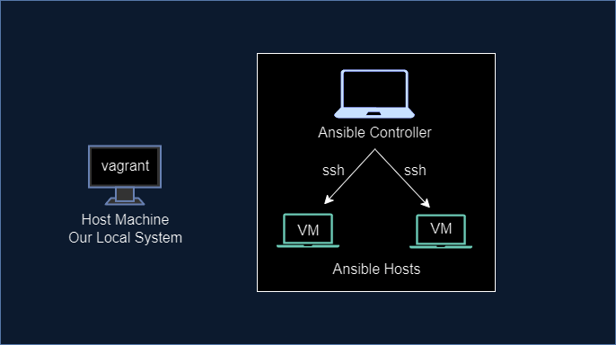

# Ansible Demo Project
  

- Install VirtualBox and Vagrant on your local machine
- Open a terminal and navigate to the directory where you want to setup your Ansible project.
- Create a new directory for your Ansible controller VM by running the command
 `mkdir ansible-controller`
- Navigate to the directory and create a new file called Vagrantfile by running the command 
`vagrant init centos/7`

- To check error in vagantfile / Validate
`vargant validate`