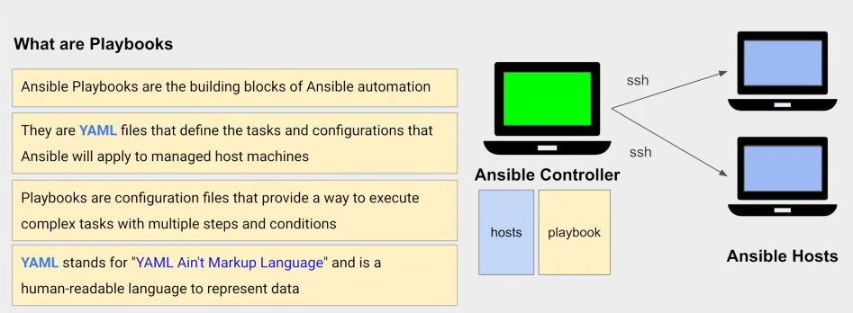
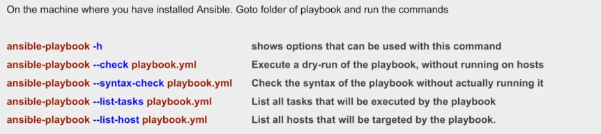
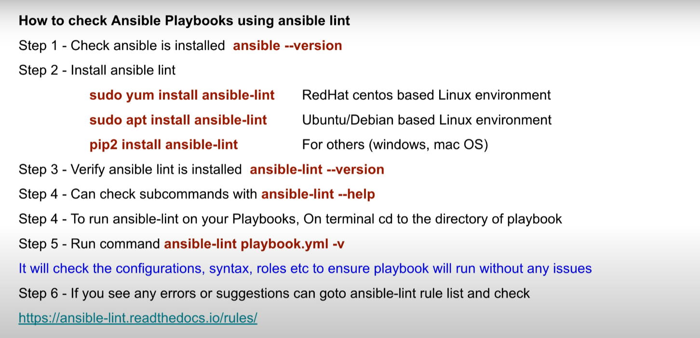
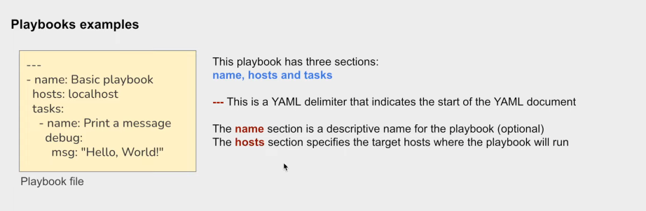
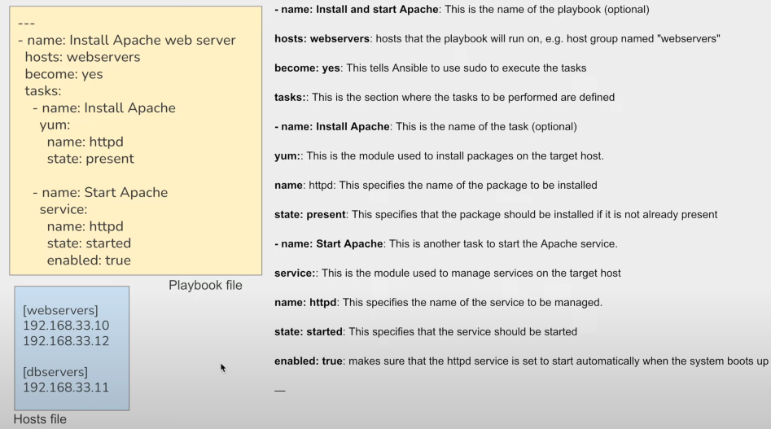

###

<h1 align="center">Ansible</h1>

###

- Ansible is a radically simple IT automation platform that makes your applications and systems easier to deploy and maintain. Automate everything from code deployment to network configuration to cloud management, in a language that approaches plain English, using SSH, with no agents to install on remote systems.
- Asible is an open source automation tool
- You can use Ansible to manage one or many computers at once
- Can do tasks like configuration management, application deployment, infrastructure setup etc.
- The details about the resources to manage (hosts) is kept in a file called `Ansible Inventory`
- The instructions to run on hists are kept in a YAML files called `playbooks`
- When playbooks is run, connection is made to the host systems and playbook instructions are executed on the `hosts`.
- Ansible Playbook --> Controller and Servers --> Hosts
  - In Ansible, the "controller" is the machine where you run Ansible commands or playbooks
  - Ansible controller is the machine or server that manages the configuration and deployment of software to other machines(hosts)
  - The controller can be any machine that meets the requirements for running Ansibl, such as a laptop, a desktop computer, a virtual machine, or a cloud-based instance
  - Ansible host is any machine that Ansible is managing
  - This can be physical server, a virtual machine, or a cloud-based instance.

- Controller - Inventory File - (hosts.ini)
  - Inventory File lists the IP addresses or domain names of those servers(hosts), and categorizes them under a group e.g. `groupA"
  - You might also specify some properties for each server, such as the username and password needed to connect to it over SSH.
- controller - Playbook - (playbook.yml)
  - Once you have defined your inventory, you can write Ansible Playbooks  that target specific groups or Individual hosts.
  - For example, you might write a playbook that installs a web server software package on all the hosts in the **groupA** group
###

<h2 align="left">How Ansible works?</h2>

###

- In Ansible, there are two categories of computers: the control node and managed nodes. The control node is a computer that runs Ansible. There must be at least one control node, although a backup control node may also exist. A managed node is any device being managed by the control node.
- Ansible works by connecting to nodes (clients, servers, or whatever you're configuring) on a network, and then sending a small program called an Ansible module to that node. Ansible executes these modules over SSH and removes them when finished. The only requirement for this interaction is that your Ansible control node has login access to the managed nodes. SSH keys are the most common way to provide access, but other forms of authentication are also supported.
- Ansible is agentless, which means the nodes it manages do not require any software to be installed on them. Ansible reads information about which machines you want to manage from your inventory. Ansible has a default inventory file, but you can create your own and define which servers you want to be managed. 

###

<h2 align="left"> Ansible Playbook </h2>

###



- While modules provide the means of accomplishing a task, the way you use them is through an Ansible playbook.
- A playbook is a configuration file written in YAML that provides instructions for what needs to be done in order to bring a managed node into the desired state.
- Playbooks are meant to be simple, human-readable, and self-documenting.
- They are also idempotent, meaning that a playbook can be run on a system at any time without having a negative effect upon it.
- If a playbook is run on a system that's already properly configured and in its desired state, then that system should still be properly configured after a playbook runs.
- Playbooks can also be very complex, with conditionals and variables. However, because most of the real work is done by Ansible modules, playbooks remain brief, readable, and clear even though they can orchestrate entire networks of managed nodes.


<br>

<a href="https://spacelift.io/blog/ansible-best-practices">More Details</a><br>
<a href="https://spacelift.io/blog/infrastructure-as-code-tools">Popular Iaac </a>


 

<h1 align="center">Ansible-lint</h1>


 

<h1 align="center">YAML</h1>

<br>
<br>

###

- YAML is a human-readable data serialization language that is often used for writing configuration files.

###

<h3 align="left">YAML syntax</h3>

###

- YAML files use a `.yml` or` .yaml` extension, and follow specific syntax rules

###

- YAML has features that come from Perl, C, XML, HTML, and other programming languages. YAML is also a superset of JSON, so JSON files are valid in YAML

###

```yaml
#Comment: Student record
#Describes some characteristics and preferences
---
name: Martin D'vloper #key-value
age: 26
hobbies: 
  - painting #first list item
  - playing_music #second list item
  - cooking #third list item
programming_languages:
  java: Intermediate
  python: Advanced
  javascript: Beginner
favorite_food: 
  - vegetables: tomatoes 
  - fruits: 
      citrics: oranges 
      tropical: bananas
      nuts: peanuts
      sweets: raisins
```

###

<h3>YAML used for?</h3>

- One of the most common uses for YAML is to create configuration files. It's recommended that configuration files be written in YAML rather than JSON, even though they can be used interchangeably in most cases, because YAML has better readability and is more user-friendly.  
- In addition to its use in Ansible, YAML is used for Kubernetes resources and deployments. 

###

<h3> YAML for Kubernetes </h3>

- Kubernetes works based on defined state and actual state. Kubernetes objects represent the state of a cluster and tell Kubernetes what you want the workload to look like. Kubernetes resources, such as pods, objects, and deployments can be created using YAML files. 
