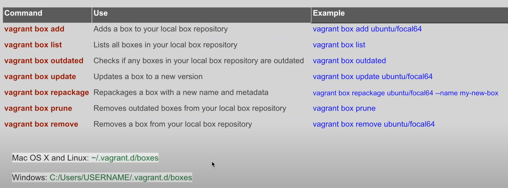
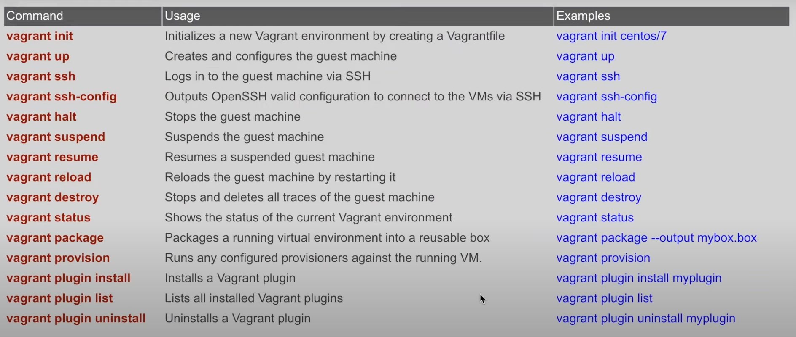
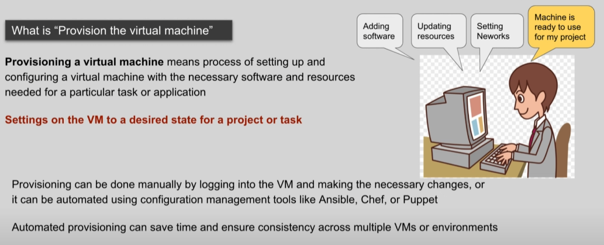

- **Vagrant** allows for easy provisioning of VM's using configuration files called `"Vagrantfiles"` which specify the desired state of the VM 

### Vagrant Install

<a href="https://developer.hashicorp.com/vagrant/install" > Install vagrant </a>

### check Installation done 
`vagrant --version`
### Select a VM Provider. Vagrant has direct support for:
`VirtualBox, Hyper-V, Docker`
### Download Virtual Box:
<a href="https://www.virtualbox.org/wiki/Downloads"> Install virtual box </a>
### Check Version:
`vboxmanage --version`
### Create new folder for Vagrant project
`vagrant`

### ON terminal or command line navigate to the folder and initiate vagrant project 
`vagrant init`  vagrant file will be created inside the folder 

- Vagrantfile is a configuration file that defines the settings for your virtual machine

### Choose a box to use 
<a href="https://app.vagrantup.com/boxes/search"> search box (vagrant cloud) </a>
- A box is a pre-configured virtual machine image that you can use as a starting point for your virtual machine

### Add configuration of the box in vagrantfile
- select box e.g: `ubuntu` open and copy `config.vm.box = "ubuntu/trusty64"`
- Paste config in vagrantfile and save

### We can also directly add configuration for the virtual machine using the following commands
`vagrant init centos/7`

### Start virtual machine using command:
`vagrant up`
- This will create a new virtual machine using the box you selected and start it. The first time, Vagrant will download the box from the internet.

`Vagrant reload`
- This is restart the machine

`vagrant provision`
- Whenever you make any changes in the provision script can run command `vagrant  provision`. This will only update the new changes (Ensure the VM is up when running this command)

### Check Vagrant list in CMD
`vagrant box list` enter  
result: `ubuntu/trusty64 (virtualbox, 20190514.0.0)`

### SSH into the virtual machine 
`vagrant ssh` enter 
result: `vagrant@vagrant-ubuntu-trusty-64:~$` 
result:
`vagrant@vagrant-ubuntu-trusty-64:/home/ubuntu$ cd ..` 
`vagrant@vagrant-ubuntu-trusty-64:/home$ ls` 
`ubuntu  vagrant`

### Shutdown virtual machine 
`vagrant halt`

### If using VirtualBox 
`vboxmanage list vms` 
`vboxmanage list runningvms`

<a href="https://vagrantfile-generator.vercel.app/">Vagrant file generator</a>

### More Commands:
  
  

