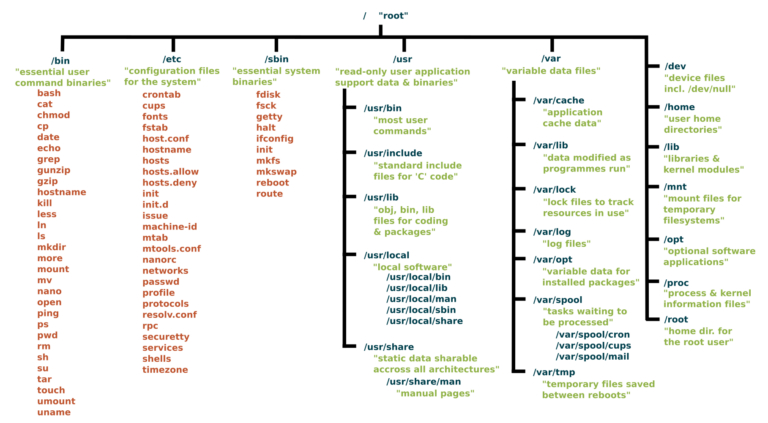

 

 <h1>LINUX</h1>

- Linux is a billion-dollar corporation nowadays. Thousands of governments and companies are using Linux operating systems across the world because of lower money, time, licensing fee, and affordability. Linux can be used within several types of electronic devices. These electronic devices are easily available for users worldwide. 

- Linux Distributions:

<ol>
  <li>Deepin</li>
  <li>OpenSUSE</li> 
  <li>Fedora</li>
  <li>Solus</li>
  <li>Ubuntu</li>
  <li>Debian</li>
  <li>Elementary</li>
  <li>Linux Mint</li>
  <li>Manjaro</li>
  <li>MX Linux</li>
</ol>

<h1>What is Operating System? </h1>

- Operating System is an interface between user and computer hardware. Computer hardware cannot understand human language and human cannot understand computers binary language. Binary language is nothing but 0’s and 1’s. 

- Types of Operating System: 

<ol>
  <li>Windows OS</li> 
  <li>Linux OS</li> 
  <li>Unix OS</li> 
</ol>
 

<h1>Architecture of Linux: </h1>

                                                  

 

<h2>Kernal:</h2>  

- The kernel is one of the core section of an operating system. It is responsible for each of the major actions of the Linux OS. It can schedule the task, manage the resources, Control the security. 

<h2>Shell:</h2> 

- It is an interface between the kernel and user. It can afford the services of kernel. It can take commands through the user and runs the functions of the kernel. 

- Shell takes input from the user and Interpreter the command and gives output to the user.  

<h2>Applicaitons: </h2>

- Applications are nothing but utilities. 

 

<h1>File System in Linux Operating System</h1> 

 

<h1>File Permissions </h1>

<ol>
 <h2>File permissions are displayed in:</h2> 
   <li><h3>Numerical representation</h3></li> 
   <li><h3>Symbolic representation</h3></li>
</ol>

 <h2>Here is the File permissions in detail🔽</h2>

<h1></h1>
$ ls -l  

 drwxr-xr-x. 4 root root 68 Jun 13 20:25 tuned  
-rw-r--r--. 1 root root 4017 Feb 24 2022 vimrc 

 

When Linux file permissions are represented by numbers, it's called numeric mode. In numeric mode, a three-digit value represents specific file permissions (for example, 744.) These are called octal values. The first digit is for owner permissions, the second digit is for group permissions, and the third is for other users. Each permission has a numeric value assigned to it: 

- r (read): 4 

- w (write): 2 

- x (execute): 1 

 

For example, a file might have read, write, and execute permissions for its owner, and only read permission for all other users. That looks like this: 

- Owner: rwx = 4+2+1 = 7 

-  Group: r-- = 4+0+0 = 4 

- others: r-- = 4+0+0 = 4 

The results produce the three-digit value 744. 

- When we create normal file, user default permissions are --> 664 

- While you create file in root user permissions are --> 644 

- When you create directory in root user, default permission is --> 755 

- When you create directory in normal user, default permission is --> 775 

- umask will sets the permissions for the linux file system. 

<h3> 002 --> ubuntu</h3> 

<h3> 022 --> root</h3> 

 

<h3> 777 -------> folder/directory </h3>

- 777 – 002 = 775 in normal user(ubuntu) 

- 777 – 022 = 755 in root user 

 

<h3> 666 -------> files </h3>

- 666 – 002 = 664 = normal user 

- 666 – 022 = 644 = root user 

<h5>Chmod command is used to change the permission of the file/folder.</h5> 
<h5>By default, execution is not available. Using chmod we can change the permissions. </h5>

 

<h1>Package Manager</h1> 

- A package manager in Linux is a tool that allows users to install, remove, upgrade, configure, and manage software packages on an operating system. 

- Common package manager in Linux: 

<h2>dpkg (Debian Package Manager) </h2> 

- APT (Advanced Package Tool)  

- rpm (RedHat Package Manager)  

- yum (Yellowdog Update Modified)  

- dnf (Dandified Yum) 

<h2>APT</h2> 

- Using APT to Manage Packages in Debian and Ubuntu 

- Distributions ----> Ubuntu, Debian, and Kali Linux 

- Commands ----> apt, apt-get, apt-cache 

- Underlying package management tool ----> dpkg 

- Package file format -----> .deb 

 

<h2>DNF</h2> 

- Using DNF to Manage Packages in CentOS/RHEL 8 and Fedora 

- Distributions: RHEL/CentOS 8, Fedora 22, and later versions of both distributions 

- Commands: dnf, yum 

- Underlying package management tool: RPM (RPM Package Manager) 

- Package file format: .rpm 

 

<h2>YUM</h2> 

- Using YUM to Manage Packages in CentOS/RHEL 7 and Earlier 

- Distributions: RHEL/CentOS 7, Fedora 21, and earlier versions of both distributions 

- Command: yum 

- Underlying package management tool: RPM (RPM Package Manager) 

- Package file format: .rpm 

 
