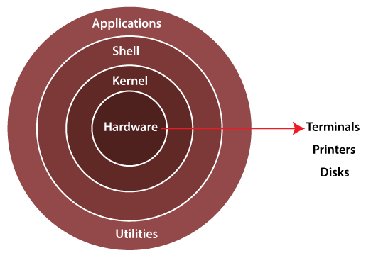
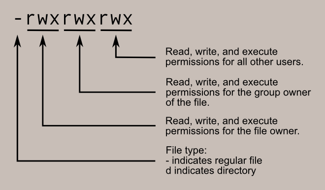

 

 <h1>LINUX</h1>

- Linux is a billion-dollar corporation nowadays. Thousands of governments and companies are using Linux operating systems across the world because of lower money, time, licensing fee, and affordability. Linux can be used within several types of electronic devices. These electronic devices are easily available for users worldwide. 

- Linux Distributions:

<ol>
  <li>Deepin</li>
  <li>OpenSUSE</li> 
  <li>Fedora</li>
  <li>Solus</li>
  <li>Ubuntu</li>
  <li>Debian</li>
  <li>Elementary</li>
  <li>Linux Mint</li>
  <li>Manjaro</li>
  <li>MX Linux</li>
</ol>

 

<h1>What is Operating System? </h1>

- Operating System is an interface between user and computer hardware. Computer hardware cannot understand human language and human cannot understand computers binary language. Binary language is nothing but 0’s and 1’s. 

- Types of Operating System: 

<ol>
  <li>Windows OS</li> 
  <li>Linux OS</li> 
  <li>Unix OS</li> 
</ol>
  

<h1>Architecture of Linux: </h1>

                                                  

 

<h2>Kernal:</h2>  

- The kernel is one of the core section of an operating system. It is responsible for each of the major actions of the Linux OS. It can schedule the task, manage the resources, Control the security.
- Kernal has 4 primary responsibilities:
    - Device Management
    - Memory Management
    - Process Management
    - Handling system related calls 

<h2>Shell:</h2> 

- It is an interface between the kernel and user. It can afford the services of kernel. It can take commands through the user and runs the functions of the kernel. 

- Shell takes input from the user and Interpreter the command and gives output to the user.  

<h2>Applicaitons: </h2>

- Applications are nothing but utilities. 

  

<h1>File System in Linux Operating System</h1> 

 
 
<h1>File Permissions </h1>

<ol>
 <h2>File permissions are displayed in:</h2> 
   <li><h3>Numerical representation</h3></li> 
   <li><h3>Symbolic representation</h3></li>
</ol>

 <h2>Here is the File permissions in detail🔽</h2>

<h1></h1>
$ ls -l  

 drwxr-xr-x. 4 root root 68 Jun 13 20:25 tuned  
-rw-r--r--. 1 root root 4017 Feb 24 2022 vimrc 

 

When Linux file permissions are represented by numbers, it's called numeric mode. In numeric mode, a three-digit value represents specific file permissions (for example, 744.) These are called octal values. The first digit is for owner permissions, the second digit is for group permissions, and the third is for other users. Each permission has a numeric value assigned to it: 

- r (read): 4 

- w (write): 2 

- x (execute): 1 

 

For example, a file might have read, write, and execute permissions for its owner, and only read permission for all other users. That looks like this: 

- Owner: rwx = 4+2+1 = 7 

-  Group: r-- = 4+0+0 = 4 

- others: r-- = 4+0+0 = 4 

The results produce the three-digit value 744. 

- When we create normal file, user default permissions are --> 664 

- While you create file in root user permissions are --> 644 

- When you create directory in root user, default permission is --> 755 

- When you create directory in normal user, default permission is --> 775 

- umask will sets the permissions for the linux file system. 

<h3> 002 --> ubuntu</h3> 

<h3> 022 --> root</h3> 

 

<h3> 777 -------> folder/directory </h3>

- 777 – 002 = 775 in normal user(ubuntu) 

- 777 – 022 = 755 in root user 

 

<h3> 666 -------> files </h3>

- 666 – 002 = 664 = normal user 

- 666 – 022 = 644 = root user 

<h5>Chmod command is used to change the permission of the file/folder.</h5> 
<h5>By default, execution is not available. Using chmod we can change the permissions. </h5>

  

<h1>Package Manager</h1> 

- A package manager in Linux is a tool that allows users to install, remove, upgrade, configure, and manage software packages on an operating system. 

- Common package manager in Linux: 

<h2>dpkg (Debian Package Manager) </h2> 

- APT (Advanced Package Tool)  

- rpm (RedHat Package Manager)  

- yum (Yellowdog Update Modified)  

- dnf (Dandified Yum) 

<h2>APT</h2> 

- Using APT to Manage Packages in Debian and Ubuntu 

- Distributions ----> Ubuntu, Debian, and Kali Linux 

- Commands ----> apt, apt-get, apt-cache 

- Underlying package management tool ----> dpkg 

- Package file format -----> .deb 

 

<h2>DNF</h2> 

- Using DNF to Manage Packages in CentOS/RHEL 8 and Fedora 

- Distributions: RHEL/CentOS 8, Fedora 22, and later versions of both distributions 

- Commands: dnf, yum 

- Underlying package management tool: RPM (RPM Package Manager) 

- Package file format: .rpm 

 

<h2>YUM</h2> 

- Using YUM to Manage Packages in CentOS/RHEL 7 and Earlier 

- Distributions: RHEL/CentOS 7, Fedora 21, and earlier versions of both distributions 

- Command: yum 

- Underlying package management tool: RPM (RPM Package Manager) 

- Package file format: .rpm 

 
<h2>Commands</h2>

| Command        | Sub command  | Description                                                                                     |
|----------------|--------------|-------------------------------------------------------------------------------------------------|
| ls             |              | `ls` command is used for listing the directories in the present working directory              |
|                | `ls -la`     | `ls -la` will show all hidden files, e.g. `.ssh`                                                |
|                | `ls -l`      | It will show the count and details of files                                                     |
| man            |              | `man` command gives documentation of the mentioned command, e.g.: `man ls`                      |
| cd             |              | It is used to navigate the directory                                                            |
| touch \<file name> |          | It will create the file                                                                         |
|                | `touch file(1..20).txt` | It will create 20 files, e.g.: `file1`, `file2`, ..., `file20`                                 |
| mkdir <folder/dir name> |      | Used to check the present working directory                                                     |
| clear          |              | Used to clear the screen                                                                         |
| mkdir <folder/dir name> |      | Used to create a folder/directory                                                               |
|                | `mkdir -p <foldername1/foldername2>` | This command is used to create a folder/directory inside the directory                |
| cat \<file name> |            | It is used to display the data inside the file                                                  |
|                | `cat > file1.txt` | It allows you to append data by terminal to file                                               |
|                | `cat >> file1.txt` | It allows you to append another data to the file                                                |
| cp \<filename> \<path> |        | Copy the file from one location to another location                                              |
| mv \<filename> \<path> | path = /home/ubuntu/folder1 | Moves file from one location to another location                                        |
|`mv options <oldfilename> <newfilename>` | Options = `-v` (verbose) | Rename the file |
| rm \<filename>  |              | Removes the file                                                                                 |
|                | `rm -rf <foldername>` | Removes a folder having content                                                                 |
|           |       rmdir       | Deletes the folder if it is empty                                                                |
| who            |              | - It is used to show the logged-in user in the server                                           |
|                |              | - It shows login time and information about the terminal                                         |
| whoami         |              | It will display the logged username. No other details will be shown                              |
| w              |              | This command is used for all login user information in the server                                |
| id             |              | This command is used to get the information of the user ID and group ID of the logged-in user    |
| echo           |              | This command is used to display the message in the terminal                                      |
|                | `echo $SHELL` | It will display which environment variable is being used                                          |
| printenv       |              | Prints all the environment variables in the server                                               |
| uname          |              | Display the OS name                                                                              |
|                | `uname -a`    | Display more details of the OS like IP address, distribution name                                |
| ln             |              | - This command is used to create a link in the Linux operating system                             |
|                |              | - While file details are started by `-`, it is a normal file                                      |
|                |              | - If it is started by `l -> lrwxrwxrwx`, it is a link file                                        |
|                |              | - If it is started by `b -> block file`                                                          |
|                | `ln -s <existingfilename> <filename>` | Filename will be linked to the existing filename                                       |
| less           |              | To display the file output in a paginated manner                                                 |
|                |              | - If you want to go to the last page, use `b`                                                     |
|                |              | - If you want to go line by line, you can use the Enter key                                       |
|                |              | - For exiting from the page, use `q`                                                              |
| more           |              | - Similar to `less` command but cannot go backward                                                |
| head           |              | This command will display the top 10 lines by default                                             |
|                | `head -n 20 /etc/passwd` | If you want to display lines as you want, use `-n`. e.g.: `cat -n /etc/passwd | head -n 20` |
| tail           |              | This command will display the bottom 10 lines by default                                          |
|                | `tail -n 20 /etc/passwd` or `tail -20 /etc/passwd` | We can display bottom lines as you want |
|                | `cat -n /etc/passwd \|head -n 20 \|tail -n 7` | If you want to get the middle lines      |
| grep \<value> \<filename> |  <a href="https://www.freecodecamp.org/news/grep-command-in-linux-usage-options-and-syntax-examples/">More detail</a>  | Grep command is used to fetch the values by matching pattern                                     |
|                | `grep -i <value> <filename>` | This command is used to fetch value if it is uppercase/lowercase character by matching pattern |
| df             |              | Df command is used to check disk space/free space available                                       |
|                | `df -h`       | It will display in an understandable format (shows `480M`)                                        |
| du -sh /home/  |              | Display the disk usage of a particular folder                                                     |
| whereis ls     |              | Display the binary location of any command                                                        |
| hostname       |              | Check the hostname of the server                                                                  |
| wget \<url>     |              | Download the binary or files from the internet using `wget http://file.txt.com/download/`         |
| curl https://www.google.com | | Curl command is used to send/transfer the data to the server                                       |
| sudo           |              | To get the root privileges|
| cal            |              | calender |
| htop | | gives nice representation of the process |
| ps             |              | Ps command is used for displaying the running processes                                           |
|                | `ps -aux`     | Display all processes which are running                                                           |
| kill -pid      |              | It is used to kill the process which is running. e.g.: `kill -9` here `9` is the process ID (PID) |
| pkill -9 process name | | Incase if you don't know process ID|
|sudo systemctl stop/start service name | | Start / stop the service |
| ifconfig       |              | - Get information about Ethernet card.                                                            |
|                |              | - To run this command, install `net-tools`: `sudo apt install net-tools`                           |
|                | `ifconfig <ethernet name>` | If you want to display 1 ethernet details. e.g.: `ifconfig eth0`                               |
| date           |              | Get the date and time from the server                                                             |
| tree /home/    |              | - Used to display the output in a tree format. Displays the folder structure in a tree format      |
|                |              | - Install `tree` command to execute: `sudo apt install tree`                                       |
| route          |              | To display the route table and to set up default gateway in the Linux server                       |
| alias d="du -sh" |            | It is used to make the command-line interface more user-friendly.|
| History | | Gives all commands execute before |
| sudo reboot | | Will reboot the server |
| sudo shutdown -h now | | will shutdown now |
| sudo shutdown | | It will take time to shutdown |

 
