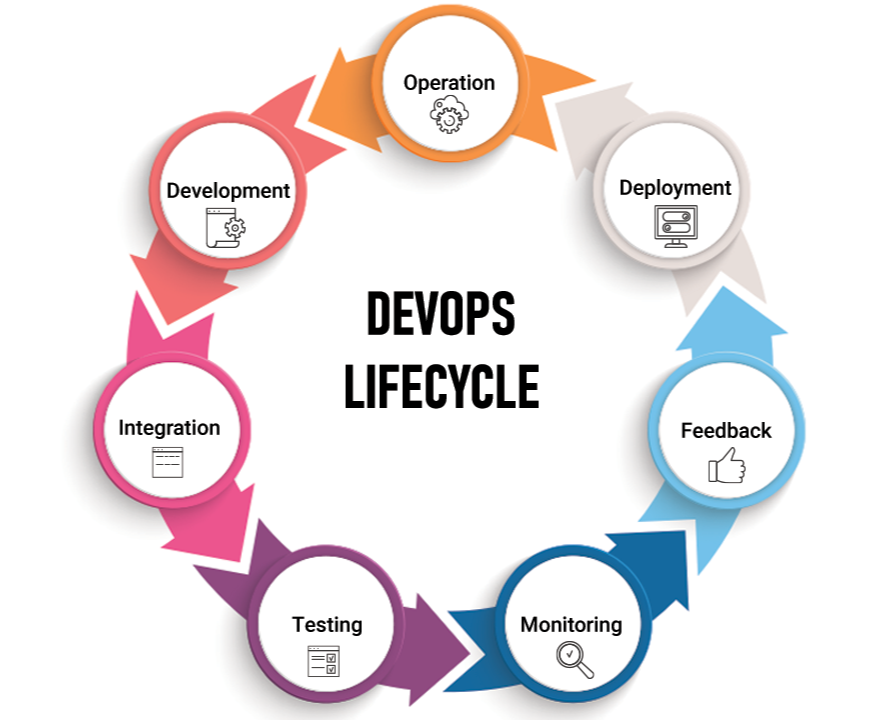

# DevOps
- Devops is basically practice/culture that we follow in organization which will increase organization's ability to deliver the application. Which is the end goal of devops.
- Delivery the new version (V1 -> V2) of software after the issue fixes is the devops.
- End goal of Devops is improving efficiency.
- Devops is improving the delivery software by automation
- Monitoring the delivery of application
    - when there is issue in quality/automation someone needs to report back to you that is monitoring
- Testing the product to deliver
- DevOps is the process of improving the delivery (Application/Script), making the delivery quicker by ensuring there is proper automation in the process and ensuring there is proper quailty and ensuring that you have set up proper continous monitoring and having continuous testing.
- To automate the manual effort for deploy the application to production server. DevOps is introduced.

  ### Manual Procedure of deploying the Application:
  - Developer/Developers build the application and put that in a central location from the central location system administrator / build and release engineer creates a server and deploy the application in server. Tester will test the application. After the testing the application Build and Release engineer will promote the Application to next level. either production server/pre-production server.
  - Centralised Code Repository:
      - CVS and SVN:-
          - CVS (Concurrent Version System) and SVN (Subversion) are both version control systems that are commonly used in software development projects to manage source code and other files. SVN is widely considered a more modern and advanced version control system than CVS. SVN supports branching and merging, atomic commits, and is more suitable for larger repositories.
          - In conclusion, CVS and SVN are both version control systems used to manage changes to software source code. However, SVN has some advantages over CVS.
          - <a href="https://www.tutorialspoint.com/difference-between-cvs-and-svn" target="_blank">To get more information about Centralised code Repository</a>
          - Bare metal hypervisation:
              - A bare metal hypervisor is a type of virtualization software that is installed directly on the hardware of the physical machine. The term bare metal refers to there is no operating system between the virtualization software and hardware.
  - Manual procedure roles:
    - System Administrator
    - Build and release engineer
    - Server Administrator

 # SDLC - Software Development Life Cycle:-
 - It is the standard procedure followed in an organization. Below are the main phases used in organization.
 - End goal is to deliver the high-quality application /product and meet the expectations of customer.
     - Design
     - Develop
     - Test
   
