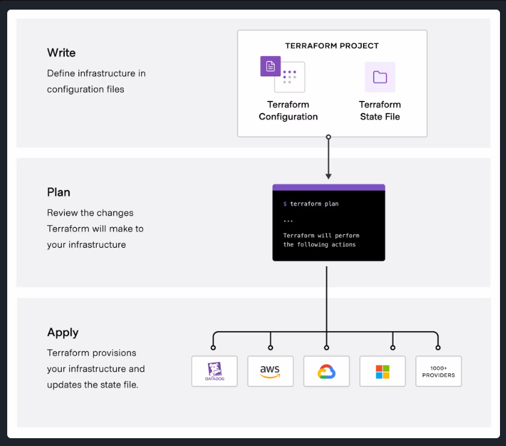

<h1 align="center"> Terraform </h1>

- Terraform is a tool that helps automate the process of setting up and managing computer infrastructure, such as servers, databases, and networking components. It uses a simple language to describe the desired configuration of this infrastructure, allowing teams to easily create, modify, and delete resources across different cloud providers and systems.

 

<div align="center">

</div>

# Getting Started

To get started with Terraform, it's important to understand some key terminology and concepts. Here are some fundamental terms and explanations.

1. **Provider**: A provider is a plugin for Terraform that defines and manages resources for a specific cloud or infrastructure platform. 
Examples of providers include AWS, Azure, Google Cloud, and many others. 
You configure providers in your Terraform code to interact with the desired infrastructure platform.

2. **Resource**: A resource is a specific infrastructure component that you want to create and manage using Terraform. Resources can include virtual machines, databases, storage buckets, network components, and more. Each resource has a type and configuration parameters that you define in your Terraform code.

3. **Module**: A module is a reusable and encapsulated unit of Terraform code. Modules allow you to package infrastructure configurations, making it easier to maintain, share, and reuse them across different parts of your infrastructure. Modules can be your own creations or come from the Terraform Registry, which hosts community-contributed modules.
- <a href="https://registry.terraform.io/">Terraform Registery </a> This is a public modules same as Docker Hub
- But most are not preffer public modules rather than writting own modules. 

4. **Configuration File**: Terraform uses configuration files (often with a `.tf` extension) to define the desired infrastructure state. These files specify providers, resources, variables, and other settings. The primary configuration file is usually named `main.tf`, but you can use multiple configuration files as well.

5. **Variable**: Variables in Terraform are placeholders for values that can be passed into your configurations. They make your code more flexible and reusable by allowing you to define values outside of your code and pass them in when you apply the Terraform configuration.

6. **Output**: Outputs are values generated by Terraform after the infrastructure has been created or updated. Outputs are typically used to display information or provide values to other parts of your infrastructure stack.

7. **State File**: Terraform maintains a state file (often named `terraform.tfstate`) that keeps track of the current state of your infrastructure. This file is crucial for Terraform to understand what resources have been created and what changes need to be made during updates.

8. **Plan**: A Terraform plan is a preview of changes that Terraform will make to your infrastructure. When you run `terraform plan`, Terraform analyzes your configuration and current state, then generates a plan detailing what actions it will take during the `apply` step.

9. **Apply**: The `terraform apply` command is used to execute the changes specified in the plan. It creates, updates, or destroys resources based on the Terraform configuration.

10. **Workspace**: Workspaces in Terraform are a way to manage multiple environments (e.g., development, staging, production) with separate configurations and state files. Workspaces help keep infrastructure configurations isolated and organized.

11. **Remote Backend**: A remote backend is a storage location for your Terraform state files that is not stored locally. Popular choices for remote backends include Amazon S3, Azure Blob Storage, or HashiCorp Terraform Cloud. Remote backends enhance collaboration and provide better security and reliability for your state files.

These are some of the essential terms you'll encounter when working with Terraform. As you start using Terraform for your infrastructure provisioning and management, you'll become more familiar with these concepts and how they fit together in your IaC workflows.

 

<h1 align="center">Install Terraform</h1>

## Windows

1. Install Terraform from the Downloads [Page](https://developer.hashicorp.com/terraform/downloads)

(or)

2. Use GitHub Codespaces (Free for 60 hours per month)

- Login to your GitHub account
- Click on the Profile Icon to the top right
- Click on "your codespaces" 
- Codespaces will provide you a virtual machine with Ubuntu and VS Code by default.
- Follow the steps provided in the Downloads [Page](https://developer.hashicorp.com/terraform/downloads) for Linux.

 

<h1 align="center">Setup Terraform for AWS </h1>

- To configure AWS credentials and set up Terraform to work with AWS, you'll need to follow these steps:

1. **Install AWS CLI (Command Line Interface)**:

Make sure you have the AWS CLI installed on your machine. You can download and install it from the [AWS CLI download page](https://aws.amazon.com/cli/).

2. **Create an AWS IAM User**:

To interact with AWS programmatically, you should create an IAM (Identity and Access Management) user with appropriate permissions. Here's how to create one:

a. Log in to the AWS Management Console with an account that has administrative privileges.

b. Navigate to the IAM service.

c. Click on "Users" in the left navigation pane and then click "Add user."

- Choose a username, select "Programmatic access" as the access type, and click "Next: Permissions."

- Attach policies to this user based on your requirements. At a minimum, you should attach the "AmazonEC2FullAccess" policy for basic EC2 operations. If you need access to other AWS services, attach the relevant policies accordingly.

- Review the user's configuration and create the user. Be sure to save the Access Key ID and Secret Access Key that are displayed after user creation; you'll need these for Terraform.

3. **Configure AWS CLI Credentials**:

Use the AWS CLI to configure your credentials. Open a terminal and run:

```
aws configure
```

**NOTE:**It will prompt you to enter your AWS Access Key ID, Secret Access Key, default region, and default output format. Enter the credentials you obtained in the previous step.

 

<h1 align="center"> Providers </h1>

- A provider in Terraform is a plugin that enables interaction with an API. 
This includes cloud providers, SaaS providers, and other APIs. The providers are specified in the Terraform configuration code. They tell Terraform which services it needs to interact with.

- For example, if you want to use Terraform to create a virtual machine on AWS, you would need to use the aws provider. The aws provider provides a set of resources that Terraform can use to create, manage, and destroy virtual machines on AWS.

- Here is an example of how to use the aws provider in a Terraform configuration:

```yaml
provider "aws" {
  region = "us-east-1"
}

resource "aws_instance" "example" {
  ami = "ami-0123456789abcdef0" # Change the AMI 
  instance_type = "t2.micro"
}
```

- In this example, we are first defining the aws provider. We are specifying the region as us-east-1. Then, we are defining the `aws_instance` resource. We are specifying the `AMI ID` and the `instance type`.

- When Terraform runs, it will first install the aws provider. Then, it will use the aws provider to create the virtual machine.

- Here are some other examples of providers:

    - `azurerm` - for Azure
    - `google` - for Google Cloud Platform
    - `kubernetes` - for Kubernetes
    - `openstack` - for OpenStack
    - `vsphere` - for VMware vSphere

- There are many other providers available, and new ones are being added all the time.

- Providers are an essential part of Terraform. They allow Terraform to interact with a wide variety of cloud providers and other APIs. This makes Terraform a very versatile tool that can be used to manage a wide variety of infrastructure.


## Different ways to configure providers in terraform

There are three main ways to configure providers in Terraform:

### In the root module 

- This is the most common way to configure providers. The provider configuration block is placed in the root module of the Terraform configuration. This makes the provider configuration available to all the resources in the configuration.

```yaml
provider "aws" {
  region = "us-east-1"
}

resource "aws_instance" "example" {
  ami = "ami-0123456789abcdef0"
  instance_type = "t2.micro"
}
```

### In a child module

- You can also configure providers in a child module. This is useful if you want to reuse the same provider configuration in multiple resources.

```yaml
module "aws_vpc" {
  source = "./aws_vpc"
  providers = {
    aws = aws.us-west-2
  }
}

resource "aws_instance" "example" {
  ami = "ami-0123456789abcdef0"
  instance_type = "t2.micro"
  depends_on = [module.aws_vpc]
}
```

### In the required_providers block

- You can also configure providers in the required_providers block. This is useful if you want to make sure that a specific provider version is used.

```yaml
terraform {
  required_providers {
    aws = {
      source = "hashicorp/aws"
      version = "~> 3.79"
    }
  }
}

resource "aws_instance" "example" {
  ami = "ami-0123456789abcdef0"
  instance_type = "t2.micro"
}
```

- The best way to configure providers depends on your specific needs. If you are only using a single provider, then configuring it in the root module is the simplest option. If you are using multiple providers, or if you want to reuse the same provider configuration in multiple resources, then configuring it in a child module is a good option. And if you want to make sure that a specific provider version is used, then configuring it in the required_providers block is the best option.

<h1 align="center">Mulitple Provider configure</h1>

You can use multiple providers in one single terraform project. For example,


1. Create a providers.tf file in the root directory of your Terraform project.
2. In the providers.tf file, define the AWS and Azure providers. For example:


```yaml
provider "aws" {
  region = "us-east-1"
}

provider "azurerm" {
  subscription_id = "your-azure-subscription-id"
  client_id = "your-azure-client-id"
  client_secret = "your-azure-client-secret"
  tenant_id = "your-azure-tenant-id"
}
```

3. In your other Terraform configuration files, you can then use the aws and azurerm providers to create resources in AWS and Azure, respectively,

```yaml
resource "aws_instance" "example" {
  ami = "ami-0123456789abcdef0"
  instance_type = "t2.micro"
}

resource "azurerm_virtual_machine" "example" {
  name = "example-vm"
  location = "eastus"
  size = "Standard_A1"
}
```

<h1 align="center">Multiple Region</h1>

- You can make use of `alias` keyword to implement multi region infrastructure setup in
terraform.

```yaml
provider "aws" {
  alias = "us-east-1"
  region = "us-east-1"
}

provider "aws" {
  alias = "us-west-2"
  region = "us-west-2"
}

resource "aws_instance" "example" {
  ami = "ami-0123456789abcdef0"
  instance_type = "t2.micro"
  provider = "aws.us-east-1"
}

resource "aws_instance" "example2" {
  ami = "ami-0123456789abcdef0"
  instance_type = "t2.micro"
  provider = "aws.us-west-2"
}
```

<h1 align="center">Provider Configuration</h1>

- The required_providers block in Terraform is used to declare and specify the required provider configurations for your Terraform module or configuration. It allows you to specify the provider name, source, and version constraints.

```yaml
terraform {
  required_providers {
    aws = {
      source  = "hashicorp/aws"
      version = "~> 3.0"
    }
    azurerm = {
      source  = "hashicorp/azurerm"
      version = ">= 2.0, < 3.0"
    }
  }
}
```
<h1 align="center">Variables</h1>

- Input and output variables in Terraform are essential for parameterizing and sharing values within your Terraform configurations and modules. They allow you to make your configurations more dynamic, reusable, and flexible.

## Input Variables

- Input variables are used to parameterize your Terraform configurations. They allow you to pass values into your modules or configurations from the outside. Input variables can be defined within a module or at the root level of your configuration. Here's how you define an input variable:

```yaml
variable "example_var" {
  description = "An example input variable"
  type        = string
  default     = "default_value"
}
```

- In this example:

    - `variable` is used to declare an input variable named `example_var`.
    - `description` provides a human-readable description of the variable.
    - `type` specifies the data type of the variable (e.g., `string`, `number`, `list`, `map`, etc.).
    - `default` provides a default value for the variable, which is optional.

- You can then use the input variable within your module or configuration like this:

```yaml
resource "example_resource" "example" {
  name = var.example_var
  # other resource configurations
}
```

- You reference the input variable using `var.example_var`.

## Output Variables

- Output variables allow you to expose values from your module or configuration, making them available for use in other parts of your Terraform setup. Here's how you define an output variable:

```yaml
output "example_output" {
  description = "An example output variable"
  value       = resource.example_resource.example.id
}
```

- In this example:

    - `output` is used to declare an output variable named `example_output`.
    - `description` provides a description of the output variable.
    - `value` specifies the value that you want to expose as an output variable. This value can be a resource attribute, a computed value, or any other expression.

- You can reference output variables in the root module or in other modules by using the syntax `module.module_name.output_name`, where `module_name` is the name of the module containing the output variable.

- For example, if you have an output variable named `example_output` in a module called `example_module`, you can access it in the root module like this:

```yaml
output "root_output" {
  value = module.example_module.example_output
}
```

**NOTE:**This allows you to share data and values between different parts of your Terraform configuration and create more modular and maintainable infrastructure-as-code setups.


# Variables Implementation Demo

```yaml

# Define an input variable for the EC2 instance type
variable "instance_type" {
  description = "EC2 instance type"
  type        = string
  default     = "t2.micro"
}

# Define an input variable for the EC2 instance AMI ID
variable "ami_id" {
  description = "EC2 AMI ID"
  type        = string
}

# Configure the AWS provider using the input variables
provider "aws" {
  region      = "us-east-1"
}

# Create an EC2 instance using the input variables
resource "aws_instance" "example_instance" {
  ami           = var.ami_id
  instance_type = var.instance_type
}

# Define an output variable to expose the public IP address of the EC2 instance
output "public_ip" {
  description = "Public IP address of the EC2 instance"
  value       = aws_instance.example_instance.public_ip
}

```


<h1 align="center">Terraform tfvars</h1>

- In Terraform, `.tfvars` files (typically with a `.tfvars` extension) are used to set specific values for input variables defined in your Terraform configuration. 

- They allow you to separate configuration values from your Terraform code, making it easier to manage different configurations for different environments (e.g., development, staging, production) or to store sensitive information without exposing it in your code.

- Here's the purpose of `.tfvars` files:

1. **Separation of Configuration from Code**: Input variables in Terraform are meant to be configurable so that you can use the same code with different sets of values. Instead of hardcoding these values directly into your `.tf` files, you use `.tfvars` files to keep the configuration separate. This makes it easier to maintain and manage configurations for different environments.

2. **Sensitive Information**: `.tfvars` files are a common place to store sensitive information like API keys, access credentials, or secrets. These sensitive values can be kept outside the version control system, enhancing security and preventing accidental exposure of secrets in your codebase.

3. **Reusability**: By keeping configuration values in separate `.tfvars` files, you can reuse the same Terraform code with different sets of variables. This is useful for creating infrastructure for different projects or environments using a single set of Terraform modules.

4. **Collaboration**: When working in a team, each team member can have their own `.tfvars` file to set values specific to their environment or workflow. This avoids conflicts in the codebase when multiple people are working on the same Terraform project.

## Summary

Here's how you typically use `.tfvars` files

1. Define your input variables in your Terraform code (e.g., in a `variables.tf` file).

2. Create one or more `.tfvars` files, each containing specific values for those input variables.

3. When running Terraform commands (e.g., terraform apply, terraform plan), you can specify which .tfvars file(s) to use with the -var-file option:

```yaml
terraform apply -var-file=dev.tfvars
```

By using `.tfvars` files, you can keep your Terraform code more generic and flexible while tailoring configurations to different scenarios and environments.


<h1 align="center">Conditional Expressions</h1>

- Conditional expressions in Terraform are used to define conditional logic within your configurations. They allow you to make decisions or set values based on conditions. Conditional expressions are typically used to control whether resources are created or configured based on the evaluation of a condition.

- The syntax for a conditional expression in Terraform is:

```yaml
condition ? true_val : false_val
```

- `condition` is an expression that evaluates to either `true` or `false`.
- `true_val` is the value that is returned if the condition is `true`.
- `false_val` is the value that is returned if the condition is `false`.

Here are some common use cases and examples of how to use conditional expressions in Terraform:

## Conditional Resource Creation Example

```yaml
resource "aws_instance" "example" {
  count = var.create_instance ? 1 : 0

  ami           = "ami-XXXXXXXXXXXXXXXXX"
  instance_type = "t2.micro"
}
```

**In this example,** the `count` attribute of the `aws_instance` resource uses a conditional expression. If the `create_instance` variable is `true`, it creates one EC2 instance. If `create_instance` is `false`, it creates zero instances, effectively skipping resource creation.

# Conditional Variable Assignment Example

```yaml
variable "environment" {
  description = "Environment type"
  type        = string
  default     = "development"
}

variable "production_subnet_cidr" {
  description = "CIDR block for production subnet"
  type        = string
  default     = "10.0.1.0/24"
}

variable "development_subnet_cidr" {
  description = "CIDR block for development subnet"
  type        = string
  default     = "10.0.2.0/24"
}

resource "aws_security_group" "example" {
  name        = "example-sg"
  description = "Example security group"

  ingress {
    from_port   = 22
    to_port     = 22
    protocol    = "tcp"
    cidr_blocks = var.environment == "production" ? [var.production_subnet_cidr] : [var.development_subnet_cidr]
  }
}

```

**In this example,** the `locals` block uses a conditional expression to assign a value to the `subnet_cidr` local variable based on the value of the `environment` variable. If `environment` is set to `"production"`, it uses the `production_subnet_cidr` variable; otherwise, it uses the `development_subnet_cidr` variable.

## Conditional Resource Configuration 

```yaml
resource "aws_security_group" "example" {
  name = "example-sg"
  description = "Example security group"

  ingress {
    from_port   = 22
    to_port     = 22
    protocol    = "tcp"
    cidr_blocks = var.enable_ssh ? ["0.0.0.0/0"] : []
  }
}
```

**In this example**, the `ingress` block within the `aws_security_group` resource uses a conditional expression to control whether SSH access is allowed. If `enable_ssh` is `true`, it allows SSH traffic from any source (`"0.0.0.0/0"`); otherwise, it allows no inbound traffic.

Conditional expressions in Terraform provide a powerful way to make decisions and customize your infrastructure deployments based on various conditions and variables. They enhance the flexibility and reusability of your Terraform configurations.

